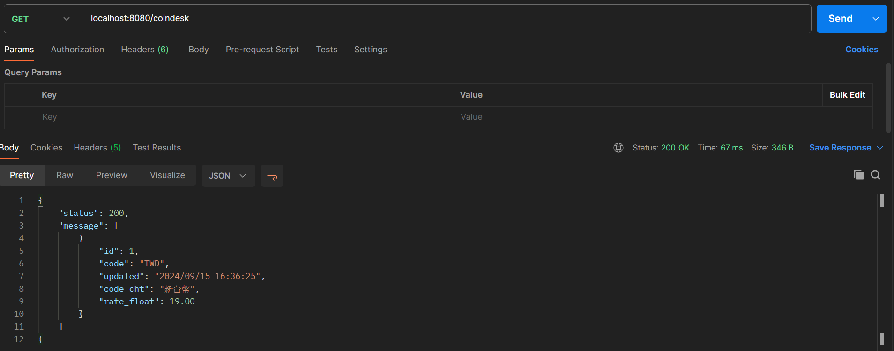
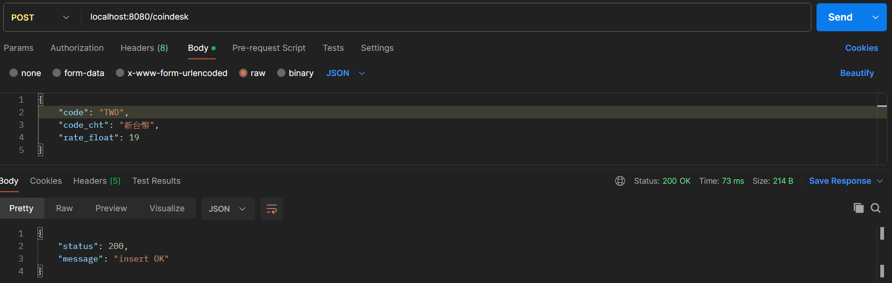
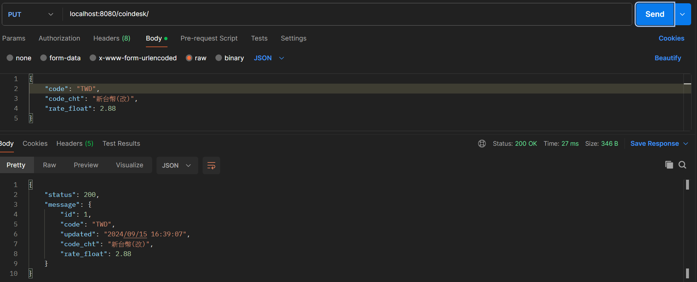
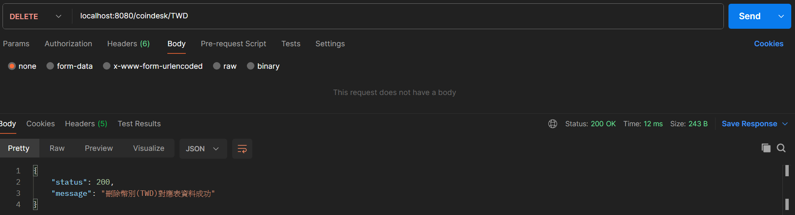
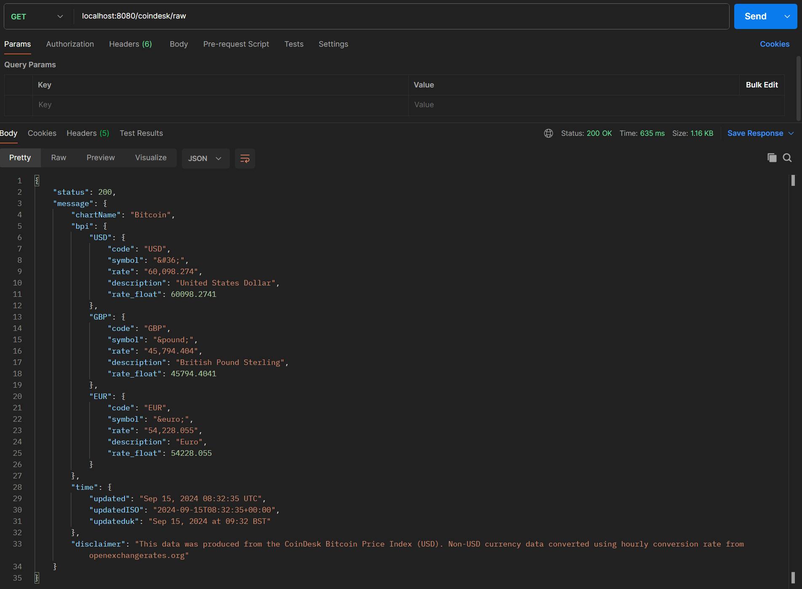
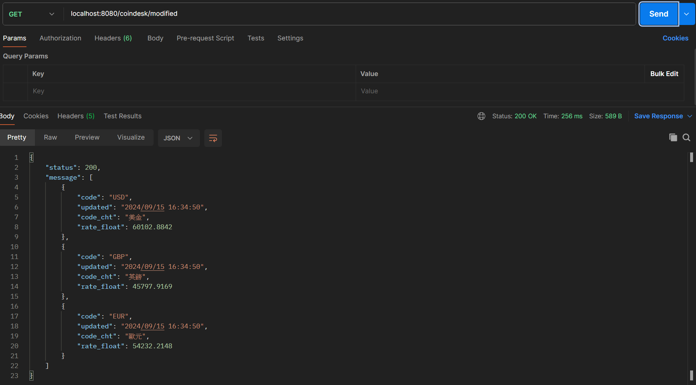

# 專案環境   
**Java：8**  
**資料庫：H2（OpenJPA / Spring Data JPA）**  
**Spring Boot: 2.7.13**  
*主要依賴如下*  
``` xml
<dependency>
  <groupId>org.springframework.boot</groupId>
  <artifactId>spring-boot-starter-data-jpa</artifactId>
</dependency>
<dependency>
  <groupId>org.springframework.boot</groupId>
  <artifactId>spring-boot-starter-web</artifactId>
</dependency>
<dependency>
  <groupId>org.springframework.boot</groupId>
  <artifactId>spring-boot-devtools</artifactId>
  <scope>runtime</scope>
  <optional>true</optional>
</dependency>
<dependency>
  <groupId>com.h2database</groupId>
  <artifactId>h2</artifactId>
  <scope>runtime</scope>
</dependency>
<dependency>
  <groupId>org.projectlombok</groupId>
  <artifactId>lombok</artifactId>
  <optional>true</optional>
</dependency>
<dependency>
  <groupId>org.springframework.boot</groupId>
  <artifactId>spring-boot-starter-validation</artifactId>
</dependency>
<dependency>
  <groupId>org.springframework.boot</groupId>
  <artifactId>spring-boot-starter-test</artifactId>
  <scope>test</scope>
</dependency>
```
# 資料庫 Table SQL 語法  
``` SQL
create table coin_desk (
        id bigint generated by default as identity,
        code varchar(255) not null,
        code_cht varchar(255) not null,
        rate_float numeric(19,2) not null,
        updated timestamp not null,
        primary key (id)
    )
alter table coin_desk 
       drop constraint if exists UK_lpo99pg2trvnqran41vwbmpn
alter table coin_desk 
       add constraint UK_lpo99pg2trvnqran41vwbmpn unique (code)
```
# Postman 測試(同單元測試)  

1.測試呼叫查詢幣別對應表資料 API，並顯示其內容。  
  
2.測試呼叫新增幣別對應表資料 API。  
  
3.測試呼叫更新幣別對應表資料 API，並顯示其內容。  
  
4.測試呼叫刪除幣別對應表資料 API。  
  
5.測試呼叫 coindesk API，並顯示其內容。  
  
6.測試呼叫資料轉換的 API，並顯示其內容。  
  
